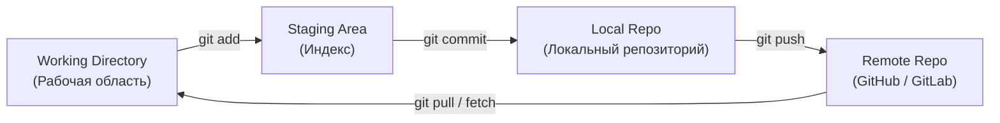

# 🎓 Подготовка к экзамену: Модуль 4 (Тестирование, Декораторы, Git)

Этот конспект структурирован для быстрого повторения теории и практического применения в автотестировании (на примере проекта **Cinescope**).

---

## 🛠 Раздел 1. Организация тестовых данных в автотестировании

### 1.1. Атомарность и надежность тестов
* **Атомарность (Atomicity):** Каждый тест должен проверять ровно одну вещь, быть полностью независимым от других тестов и выполняться в любом порядке.
  * *Плохо:* Тест 2 падает, потому что Тест 1 не создал пользователя.
  * *Хорошо:* Тест 2 сам создает пользователя через фикстуру/API, проверяет логику и удаляет его за собой.
* **Надежность (Reliability / Flakiness-free):** Тест должен быть детерминированным. Если код приложения не менялся, тест должен всегда давать один и тот же результат.

### 1.2. Что такое фикстура (Fixture)?
> [!NOTE]  
> **Фикстура** — это фиксированное состояние или окружение, необходимое для выполнения теста (подготовка данных, запуск браузера, создание сессий, очистка БД).

* **Pre-conditions (До теста):** Подготовка (создание пользователя в БД, авторизация).
* **Post-conditions / Teardown (После теста):** Очистка (удаление пользователя, закрытие сессии).
* **В pytest** фикстуры реализуются через декоратор `@pytest.fixture`. Жизненный цикл регулируется аргументом `scope` (`function`, `class`, `module`, `package`, `session`).

---

### 1.3. Паттерны организации тестовых данных
При тестировании API (например, кинотеатра) нам постоянно нужны тестовые сущности: `User`, `Movie`, `Review`. Как их создавать?

#### 1. Object Mother (Объектная мама)
Класс со статическими методами, которые возвращают преднастроенные готовые объекты с валидными или невалидными данными.
* **Пример:** `DataGenerator` в твоем проекте ([data_generator.py](file:///Users/modnyjpacyk/PycharmProjects/Cinescope/utils/data_generator.py)) — это разновидность Object Mother. Он генерирует готовые валидные email, пароли и имена.
* **Плюсы:** Быстро, просто.
* **Минусы:** Сложно кастомизировать объект «на лету» в тесте (например, если нужен юзер с конкретным email).

#### 2. Builder (Строитель)
Паттерн проектирования, который позволяет создавать сложные объекты пошагово.
* **Пример кода:**
```python
class UserBuilder:
    def __init__(self):
        self.user = {
            "email": "default@mail.com",
            "fullName": "John Doe",
            "password": "Password123!",
            "passwordRepeat": "Password123!"
        }

    def with_email(self, email):
        self.user["email"] = email
        return self  # Возвращаем self для цепочки вызовов (fluent interface)

    def with_invalid_password(self):
        self.user["password"] = "123"
        return self

    def build(self):
        return self.user

# Использование в тесте:
custom_user = UserBuilder().with_email("admin@cinescope.ru").with_invalid_password().build()
```
* **Плюсы:** Гибкость. Можно собрать любой объект под конкретный тест.

#### 3. Factory (Фабрика / Factory Boy)
Использование специальных библиотек (например, `factory_boy` в Python) для декларативного описания моделей данных.
* **Пример кода (с factory_boy):**
```python
import factory
from dataclasses import dataclass

@dataclass
class User:
    email: str
    fullName: str
    password: str

class UserFactory(factory.Factory):
    class Meta:
        model = User

    email = factory.Faker("email")
    fullName = factory.Faker("name")
    password = "DefaultPassword123!"

# Использование в тесте:
user1 = UserFactory() # сгенерирует случайные email и name
user2 = UserFactory(email="custom@mail.ru") # переопределит только email
```

---

## 🧠 Раздел 2. Декораторы в Python

### 2.1. Зачем нужны декораторы?
> [!IMPORTANT]  
> **Декоратор** — это функция, которая принимает другую функцию в качестве аргумента, добавляет к ней некоторую функциональность (обертку) и возвращает измененную функцию, не меняя при этом ее исходный код.

Три ключевые причины использования:
1. **Код чужих библиотек:** Вы не можете изменить код внутри импортированной библиотеки (например, `requests.get`), но можете обернуть его декоратором.
2. **Переиспользование кода (DRY):** Логика (замер времени, логирование, валидация прав) пишется 1 раз, а применяется к десяткам функций через `@decorator_name`.
3. **Разделение обязанностей (Single Responsibility):** Функция должна заниматься только бизнес-логикой. Декоратор забирает на себя служебные задачи (кэширование, логирование запросов).

### 2.2. Как работает декоратор под капотом
Функции в Python являются **объектами первого класса** (First-Class Citizens). Это значит, что их можно передавать в другие функции как аргументы, сохранять в переменные и возвращать из других функций.

#### Пример декоратора без аргументов:
```python
import time

def measure_time(func):
    def wrapper(*args, **kwargs):
        start = time.time()
        # Вызов исходной функции
        result = func(*args, **kwargs)
        duration = time.time() - start
        print(f"Функция {func.__name__} выполнена за {duration:.4f} сек")
        return result  # Важно вернуть результат исходной функции
    return wrapper

@measure_time
def process_movie_catalog():
    time.sleep(1) # имитация работы
    return "Каталог обработан"
```

#### Пример декоратора с аргументами (трехуровневая функция):
Если нужно передать параметр в сам декоратор (например, роль пользователя для проверки прав):
```python
def check_role(required_role):
    def decorator(func):
        def wrapper(*args, **kwargs):
            # Предположим, первый аргумент функции — это объект пользователя
            user = args[0] if args else kwargs.get("user")
            if user.get("role") != required_role:
                raise PermissionError(f"Доступ запрещен. Требуется роль: {required_role}")
            return func(*args, **kwargs)
        return wrapper
    return decorator

@check_role(required_role="admin")
def delete_movie(user, movie_id):
    print(f"Фильм {movie_id} успешно удален пользователем {user['fullName']}")
```

---

## 📚 Раздел 3. Теоретический стек библиотек (pytest, requests, faker)

Для экзамена важно четко понимать назначение каждой библиотеки в проекте Cinescope:

| Библиотека | Зачем нужна в проекте | Основные фичи и сущности |
| :--- | :--- | :--- |
| **`pytest`** | Тестовый фреймворк (скелет проекта) | `@pytest.fixture`, `@pytest.mark.parametrize`, запуск тестов, отчеты, ассерты `assert`. |
| **`requests`** | HTTP-клиент для отправки запросов к API кинотеатра | `requests.Session()`, методы `.get()`, `.post()`, статус-коды, тела запросов (`json=`, `data=`). |
| **`faker`** | Генератор реалистичных фейковых данных | `faker.first_name()`, `faker.email()`, `faker.text()`. Помогает избегать дублирования данных при регистрации. |

### Реальный пример из проекта Cinescope:
В файле [conftest.py:L10-17](file:///Users/modnyjpacyk/PycharmProjects/Cinescope/conftest.py#L10-L17) фикстура `test_user` готовит данные для регистрации с использованием нашего генератора:
```python
@pytest.fixture(scope="function")
def test_user():
    password = DataGenerator.generate_random_password()
    return {
        "email": DataGenerator.generate_random_email(),
        "fullName": DataGenerator.generate_random_name(),
        "password": password,
        "passwordRepeat": password
    }
```

---

## 🐙 Раздел 4. Практика и теория по Git для QA

На экзамене часто спрашивают базу по Git. Ниже собраны ключевые сценарии и теория.

### 4.1. Три зоны Git
1. **Working Directory (Рабочая директория):** Где ты изменяешь файлы прямо сейчас.
2. **Staging Area / Index (Область подготовки):** Временное хранилище изменений, готовых для коммита (`git add`).
3. **Local Repository (Локальный репозиторий):** База коммитов на твоем компьютере (`git commit`).
4. **Remote Repository (Удаленный репозиторий):** Репозиторий на GitHub/GitLab (`git push`).



---

### 4.2. Шпаргалка по основным командам

* **`git status`** — проверить состояние файлов (какие изменены, какие добавлены в индекс).
* **`git diff`** — посмотреть изменения в коде до добавления в индекс.
* **`git add <file>`** — добавить файл в индекс. `git add .` — добавить все файлы.
* **`git commit -m "сообщение"`** — зафиксировать изменения локально с понятным комментарием.
* **`git push origin <branch>`** — отправить локальные коммиты в удаленную ветку.
* **`git pull origin <branch>`** — забрать изменения из удаленной ветки и слить их со своей локальной.
* **`git fetch`** — скачать информацию о новых ветках и коммитах с сервера, но **не сливать** их с локальным кодом (безопасное обновление).
* **`git checkout -b <new_branch>`** (или `git switch -c <new_branch>`) — создать новую ветку и переключиться на нее.

---

### 4.3. Решение нештатных ситуаций (Практика)

#### Сценарий А: «Я написал коммит, но допустил ошибку в сообщении или забыл файл»
* **Решение:** `git commit --amend`
* *Как работает:* Добавь забытый файл через `git add <file>`, а затем введи `git commit --amend -m "Новое правильное сообщение"`. Старый коммит заменится новым.

#### Сценарий Б: «Я написал код, коммитить еще рано, но мне нужно срочно переключиться на другую ветку и исправить баг»
* **Решение:** `git stash`
* *Как работает:*
  1. `git stash` — прячет твои текущие незакоммиченные изменения в карман. Рабочая директория становится чистой.
  2. Переключаешься, правишь баг, коммитишь, пушишь.
  3. Возвращаешься на свою ветку.
  4. `git stash pop` — достает твои изменения из кармана и возвращает в рабочую область.

#### Сценарий В: «Я сделал коммит локально, но понял, что он вообще не нужен и все сломал»
* **Решение:** 
  * Если нужно отменить коммит, но **сохранить изменения** в файлах как незакоммиченные:
    `git reset --soft HEAD~1`
  * Если нужно стереть коммит и **полностью удалить все изменения** (опасно!):
    `git reset --hard HEAD~1`

---

### 4.4. Как решать конфликты слияния (Merge Conflicts)
Конфликт возникает, когда два человека изменили **одну и ту же строку** в одном файле в разных ветках, и Git не знает, какую версию выбрать.

1. При попытке сделать `git merge` or `git pull` Git напишет: `CONFLICT (content): Merge conflict in file.md`.
2. Открой файл. Git добавит в него маркеры конфликта:
   ```text
   <<<<<<< HEAD
   твой код (текущая ветка)
   =======
   код коллеги (вмерживаемая ветка)
   >>>>>>> branch-name
   ```
3. **Что делать:**
   * Обсуди с коллегой, какой вариант верный (или объедини их).
   * Вручную удали маркеры конфликта (`<<<<<<<`, `=======`, `>>>>>>>`) и оставь только правильный код.
   * Добавь исправленный файл в индекс: `git add <file>`.
   * Заверши слияние коммитом: `git commit -m "Fix merge conflicts"`.
